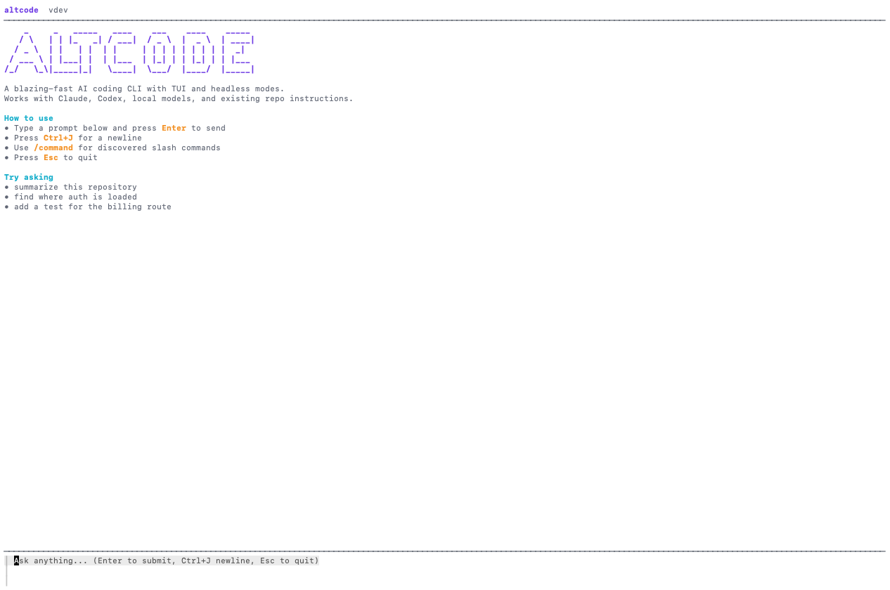

# altcode



**[altcode.io](https://altcode.io)** · [Install](#install) · [Docs](https://github.com/jiayaoqijia/altcode/blob/main/README.md) · [Releases](https://github.com/jiayaoqijia/altcode/releases)

The **multi-AI coding CLI** — orchestrate Claude Code, Codex, DeepSeek, Qwen, Kimi, Gemini and more to design, think, and evaluate code together.

**5ms startup. 10MB binary. 10+ models. Multi-AI orchestration.**

## Why altcode?

**Different AI models see different things.** Claude is great at architecture. DeepSeek excels at code generation. GPT catches edge cases others miss. Qwen is fast and free.

Instead of picking one, altcode lets them **work as a team** — each model plays a role (architect, implementer, reviewer, challenger) and they cross-check each other's work.

```bash
# Multiple AI models collaborate on the same task
altcode team "Add rate limiting to the API"

# Or use it as a single-model CLI (like Claude Code or Codex)
altcode "explain this error"
```

### Multi-AI Orchestration

```
                    ┌─────────────┐
                    │   altcode    │
                    │ orchestrator │
                    └──────┬──────┘
           ┌───────────────┼───────────────┐
           │               │               │
    ┌──────┴──────┐ ┌──────┴──────┐ ┌──────┴──────┐
    │ Claude Code │ │  Codex CLI  │ │   DeepSeek  │
    │ (architect) │ │ (reviewer)  │ │ (challenger)│
    └─────────────┘ └─────────────┘ └─────────────┘
           │               │               │
           └───────────────┼───────────────┘
                    Cross-check → Verdict
```

altcode can call **actual coding CLIs** (Claude Code, Codex, Gemini) as backends using your existing subscriptions, OR connect to models directly via API. No other tool does this.

### altcode vs others

| | Claude Code | Codex CLI | altcode |
|---|:-:|:-:|:-:|
| Models | Claude only | GPT only | **All** (Claude + GPT + DeepSeek + Qwen + 100+) |
| Multi-AI | No | No | **Yes** (parallel orchestration + cross-check) |
| CLI backends | — | — | **Calls Claude Code + Codex as backends** |
| Startup | ~200ms | ~200ms | **5ms** (40x faster) |
| Binary | ~50MB | ~50MB | **10MB** (5x smaller) |
| Hooks | ~10 events | — | **13 events** |
| Plugins | Claude format | — | **Loads Claude Code plugins natively** |
| Memory | Persistent | **Persistent** (compatible format) |
| Auth | Anthropic OAuth | **Claude sub + Codex sub + OpenRouter + API keys** |
| Tests | Closed source | **340+ tests** (mock + live) |
| Source | Plugins only | **Fully open** |

### Benchmarks (5 suites × 6 models)

| Model | Score | Cost |
|-------|:-----:|------|
| DeepSeek V3 | **96%** | ~$0.001/req |
| MiniMax 2.7 | **93%** | ~$0.002/req |
| Qwen Coder | **93%** | free tier |
| Claude Haiku | 90% | subscription |
| GLM-5 | 76% | ~$0.001/req |

*HumanEval + SWE-bench + Terminal-Bench + Aider + FeatureBench — all via altcode*

## Features

- **Multi-turn agent loop** — model calls tools, gets results, loops until done (50-iteration cap)
- **Multi-provider** — Anthropic, OpenAI/Codex, DeepSeek, Zhipu/GLM, Moonshot/Kimi, MiniMax, Qwen, Ollama, LMStudio, OpenRouter (100+ models), any OpenAI-compatible API
- **Zero config auth** — auto-detects Claude Code, Codex CLI subscriptions, and 7 provider API keys
- **Workflow mode** — optional `altcode workflow` with interview, planning, and persistent execution (ralph) modes
- **7 built-in tools** — read, glob, grep, ls, bash, edit, write
- **MCP client** — stdio + SSE/HTTP transports with auto-discovery and namespace isolation
- **13 hook events** — PreToolUse, PostToolUse, Stop, SessionStart/End, UserPromptSubmit, SubagentStop, PreCompact, Notification, CwdChanged, FileChanged, TaskCreated, PermissionDenied
- **Slash commands** — markdown files with YAML frontmatter, `!backtick` expansion, `$ARGUMENTS`
- **Plugin system** — loads `.altcode-plugin/` and `.claude-plugin/` formats, marketplace support
- **Subagent system** — spawn restricted child engines with tool subset, model override, depth limits
- **Persistent memory** — cross-session knowledge in markdown files with MEMORY.md index
- **Exec mode** — `altcode "prompt"` for headless/CI use, `--json` for JSONL event stream
- **Session persistence** — SQLite storage with `--last` resume and `sessions` subcommand
- **Permission system** — 4 modes (default/auto/bypass/plan) with glob rules and doom loop detection
- **Auto-compact** — triggers microcompaction at 100 messages, fires PreCompact hooks
- **Streaming TUI** — Bubbletea-based with markdown rendering, themes, header, status bar
- **Claude Code compatible** — loads CLAUDE.md, plugins, hooks, commands, agents, and memory natively
- **Rich system prompt** — behavioral instructions modeled on Claude Code's prompt engineering

## Install

**macOS / Linux (recommended):**
```bash
curl -fsSL https://altcode.io/install.sh | bash
```

**Build from source:**
```bash
git clone git@github.com:jiayaoqijia/altcode.git
cd altcode && make build
sudo cp dist/altcode /usr/local/bin/
```

**Pre-built binaries** (from [Releases](https://github.com/jiayaoqijia/altcode/releases)):

| Platform | Binary | Size |
|----------|--------|:----:|
| macOS Apple Silicon | `altcode-darwin-arm64` | 10MB |
| macOS Intel | `altcode-darwin-amd64` | 11MB |
| Linux x86_64 | `altcode-linux-amd64` | 11MB |
| Linux ARM64 | `altcode-linux-arm64` | 10MB |
| Windows x64 | `altcode-windows-amd64.exe` | 11MB |

**Uninstall:** `rm $(which altcode)`

No runtime dependencies. No Node.js. No Python. Just a single binary.

## Get Started

1. **Zero configuration** — altcode auto-detects your existing subscriptions:

    | If you have... | altcode uses it automatically |
    |----------------|------------------------------|
    | Claude Code CLI (`~/.claude/.credentials.json`) | Claude subscription (Max/Pro) |
    | Codex CLI (`~/.codex/auth.json` + `config.toml`) | Codex subscription + relay URL + model |
    | `ANTHROPIC_API_KEY` env var | Anthropic API |
    | `OPENAI_API_KEY` env var | OpenAI API |
    | `DEEPSEEK_API_KEY` env var | DeepSeek (api.deepseek.com) |
    | `ZHIPU_API_KEY` env var | GLM-5 (open.bigmodel.cn) |
    | `MOONSHOT_API_KEY` env var | Kimi K2.5 (api.moonshot.cn) |
    | `MINIMAX_API_KEY` env var | MiniMax M2.7 (api.minimax.chat) |
    | `DASHSCOPE_API_KEY` env var | Qwen (dashscope.aliyuncs.com) |
    | `OPENROUTER` env var or `.env` file | 100+ models via OpenRouter |

    **No setup needed if you already use Claude Code or Codex CLI.** Just install and run.

    For local models (no key needed):
    ```bash
    ollama serve &  # install from https://ollama.ai
    ```

2. Run altcode:

    ```bash
    # Interactive TUI (auto-detects provider)
    altcode

    # With model override
    altcode --model anthropic/claude-sonnet-4-20250514
    altcode --model openai/gpt-4
    altcode --model ollama/llama3
    altcode --model openai/deepseek/deepseek-chat-v3-0324  # via OpenRouter

    # Chinese AI providers (direct API or OpenRouter fallback)
    altcode --model deepseek/deepseek-chat "fix this"
    altcode --model zhipu/glm-5 "explain this"
    altcode --model moonshot/kimi-k2.5 "review this code"
    altcode --model minimax/MiniMax-M2.7 "write tests"
    altcode --model qwen/qwen3-coder "refactor this"

    # Structured workflow mode (optional)
    altcode workflow "add auth"                        # auto-detect mode
    altcode workflow --mode interview "add auth"       # Socratic clarification
    altcode workflow --mode plan "add auth"             # consensus planning
    altcode workflow --mode ralph "add auth"            # persistent until done

    # Headless exec mode (for scripts/CI)
    altcode "explain this error"
    altcode --json "list files"    # JSONL event stream

    # Session management
    altcode --last                 # resume last session
    altcode --session ID           # resume specific session
    altcode sessions               # list all sessions
    ```

3. (Optional) Load Claude Code plugins:

    ```bash
    # Copy Claude Code's official plugins
    git clone https://github.com/anthropics/claude-code.git /tmp/cc
    cp -r /tmp/cc/plugins ~/.config/altcode/plugins/
    rm -rf /tmp/cc
    ```

    Plugins auto-discovered from `~/.config/altcode/plugins/` and `.altcode/plugins/`.
    All 12 official Claude Code plugins work — commands, agents, hooks, and skills.

## Architecture

```
cmd/altcode/         Entry point (Cobra CLI)
internal/
├── engine/          Agent loop with tool dispatch + session persistence
├── provider/        Provider interface (Anthropic SSE + OpenAI SSE)
├── tool/            Tool interface, registry, concurrent dispatch
├── permission/      Permission evaluator (4 modes, doom loop)
├── hooks/           Hook system (13 events, command handlers)
├── mcp/             MCP client (stdio + SSE transports)
├── command/         Slash commands (markdown + frontmatter)
├── plugin/          Plugin discovery, loading, marketplace
├── agent/           Subagent definitions, spawn, registry
├── memory/          Persistent cross-session memory
├── auth/            Auto-detect Claude Code + Codex CLI credentials
├── store/           SQLite storage (sessions + messages)
├── config/          JSONC config, env expansion, instruction cascade
├── compact/         Context compaction (budget + microcompact)
├── exec/            Headless execution mode
├── tui/             Bubbletea TUI (markdown, header, status, palette)
├── sysctl/          System prompt assembly
└── event/           Event types (engine ↔ TUI)
```

## Configuration

Config files in JSONC (JSON with comments), loaded in cascade:
1. `~/.config/altcode/config.json` (user)
2. `.altcode/config.json` (project)
3. `--config` flag (explicit)
4. CLI flags (`--model`, `--theme`)
5. Environment variables
6. Auto-detected CLI credentials (Claude Code, Codex)

```jsonc
{
  "model": "anthropic/claude-sonnet-4-20250514",
  "provider": {
    "anthropic": { "apiKey": "$ANTHROPIC_API_KEY" },
    "openai": { "apiKey": "$OPENAI_API_KEY", "baseURL": "https://api.openai.com" },
    "deepseek": { "apiKey": "$DEEPSEEK_API_KEY" },
    "zhipu": { "apiKey": "$ZHIPU_API_KEY" },
    "moonshot": { "apiKey": "$MOONSHOT_API_KEY" },
    "minimax": { "apiKey": "$MINIMAX_API_KEY" },
    "qwen": { "apiKey": "$DASHSCOPE_API_KEY" },
    "ollama": { "baseURL": "http://localhost:11434" }
  },
  "hooks": {
    "PreToolUse": [
      { "matcher": "Bash", "hooks": [{ "type": "command", "command": "validate.sh" }] }
    ]
  },
  "theme": "catppuccin-mocha"
}
```

## Claude Code Compatibility

altcode natively loads Claude Code plugins from `.claude-plugin/` directories:

```
All 12 official Claude Code plugins verified:
  commit-commands      3 commands                    ✓
  feature-dev          1 command + 3 agents          ✓
  pr-review-toolkit    1 command + 6 agents          ✓
  code-review          1 command                     ✓
  security-guidance    1 PreToolUse hook              ✓
  hookify              4 commands + 1 agent + 4 hooks ✓
  ralph-wiggum         3 commands + 1 Stop hook       ✓
  explanatory-output   1 SessionStart hook            ✓
  learning-output      1 SessionStart hook            ✓
  plugin-dev           1 command + 3 agents           ✓
  agent-sdk-dev        1 command + 2 agents           ✓
  frontend-design      skill-based                    ✓
```

Instruction cascade: `CLAUDE.md` → `AGENTS.md` → `ALTCODE.md` → `.altcode/rules/*.md`

Memory: reads both `.altcode/memory/` and `.claude/memory/` directories.

## Hooks

13 events with command-based handlers (Claude Code compatible format):

```jsonc
{
  "hooks": {
    "PreToolUse": [{ "matcher": "Write|Edit", "hooks": [{"type": "command", "command": "python3 validate.py"}] }],
    "PostToolUse": [{ "matcher": "*", "hooks": [{"type": "command", "command": "lint.sh"}] }],
    "Stop": [{ "matcher": "*", "hooks": [{"type": "command", "command": "check-tests.sh"}] }]
  }
}
```

Exit codes: `0` = allow, `2` = deny (stderr fed to agent), other = error (default allow).
Hook input: JSON on stdin with `toolName`, `toolInput`, `event`, `sessionId`.

## Development

```bash
make build     # Build binary (dist/altcode)
make test      # Run tests with race detector
make lint      # Run go vet

# Cross-compile
GOOS=darwin GOARCH=arm64 GOFLAGS=-mod=mod go build -o altcode-mac ./cmd/altcode

# Run full test suite
GOFLAGS=-mod=mod go test ./... -race -count=1 -timeout=180s -parallel=8

# Run live tests (needs API keys)
GOFLAGS=-mod=mod go test ./internal/ -v -run "TestLive" -timeout=300s
```

## Links

- **Website**: [altcode.io](https://altcode.io)
- **GitHub**: [github.com/jiayaoqijia/altcode](https://github.com/jiayaoqijia/altcode)
- **Releases**: [Download binaries](https://github.com/jiayaoqijia/altcode/releases)

## License

See [LICENSE](LICENSE).
